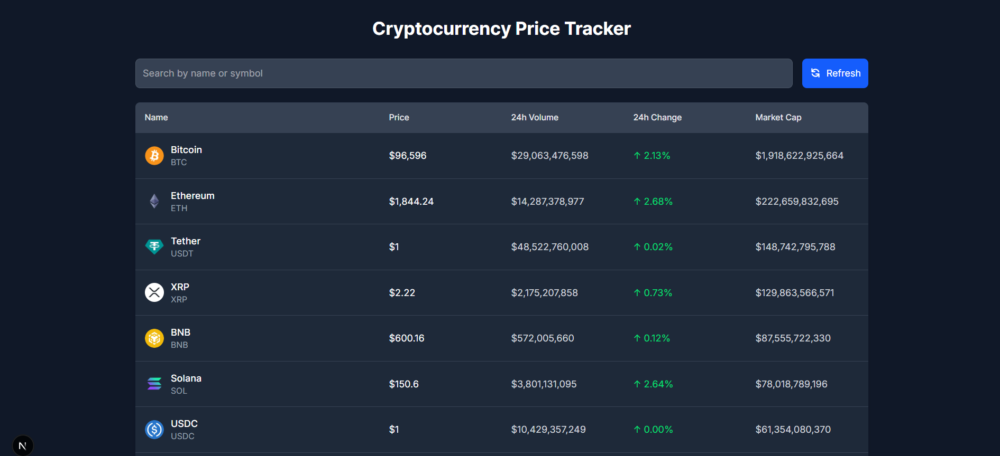

# 🚀 CryptoTracker

A sleek and modern cryptocurrency price tracker built with **Next.js**, **TypeScript**, **Tailwind CSS**, **Zustand**, and the **CoinGecko API**.



---

## 🌐 Live Demo

Coming soon! _(Or add your deployment link here)_

---

## 🛠️ Tech Stack

- **Frontend:** [Next.js](https://nextjs.org/), [TypeScript](https://www.typescriptlang.org/)
- **Styling:** [Tailwind CSS](https://tailwindcss.com/)
- **State Management:** [Zustand](https://zustand-demo.pmnd.rs/)
- **Data Fetching:** [Axios](https://axios-http.com/)
- **API Source:** [CoinGecko API](https://www.coingecko.com/en/api)

---

## 📦 Installation

```bash
# Clone the repository
git clone https://github.com/rohitkatkarr/cointrack.git

# Install dependencies
npm install

# Run the development server
npm run dev
```

---

## 🧠 Features

- 🔍 Track real-time crypto prices via CoinGecko

- 🌙 Light/Dark mode (optional with Tailwind)

- 💾 Persistent state using Zustand

- 📊 Clean and responsive UI with Tailwind

- 📘 Dedicated documentation site

## 📁 Project Structure

/
├── pulic/        # Static assets
├── src/        # Source Folder
    ├── app/
    ├── components/        # Reusable UI components
    ├── services/           # API management
    ├── store/            # Zustand state management

## 🤝 Contributing

Feel free to open issues or submit pull requests to improve the project!

## 📜 License
MIT License © Rohit Katkar
